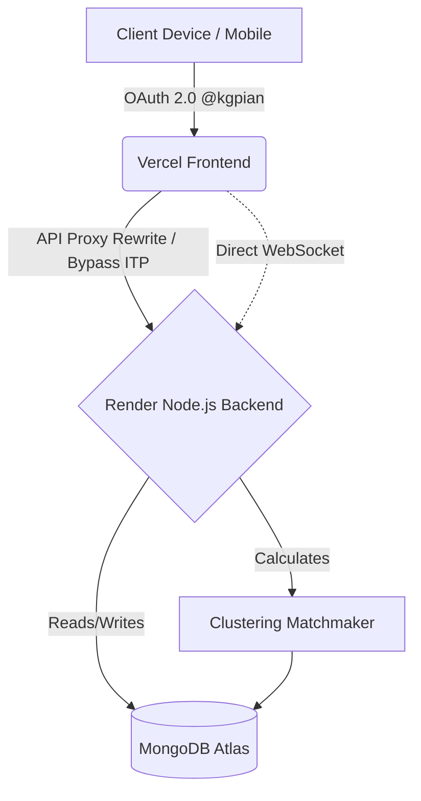
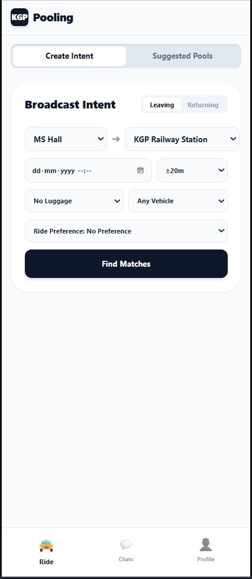
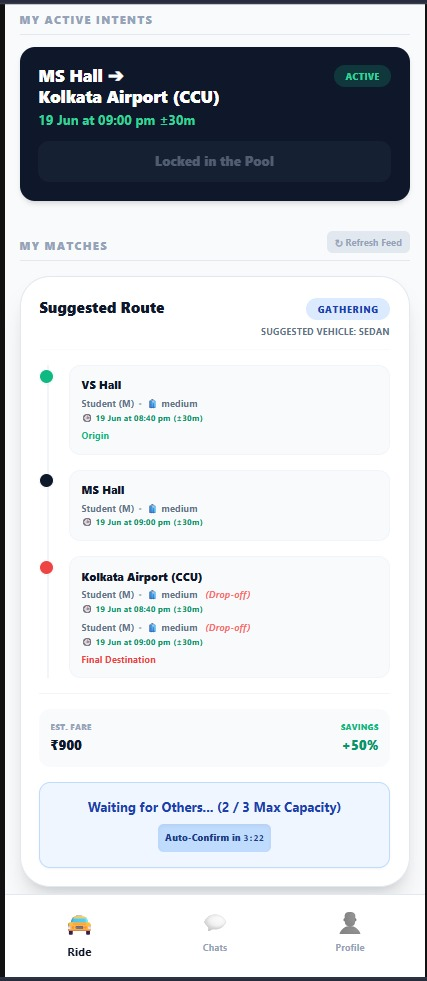
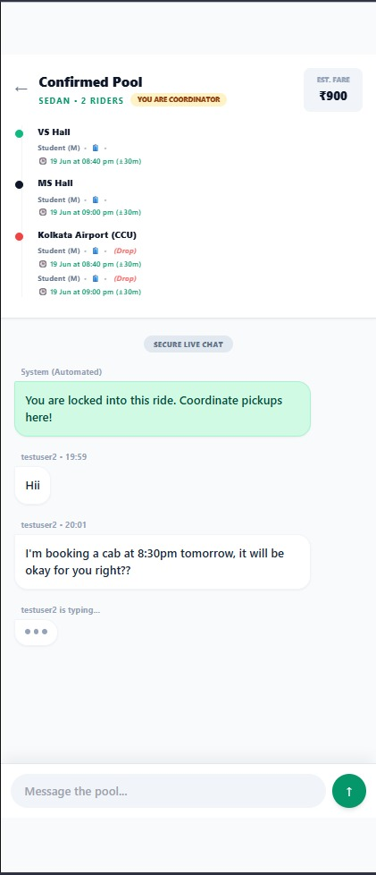
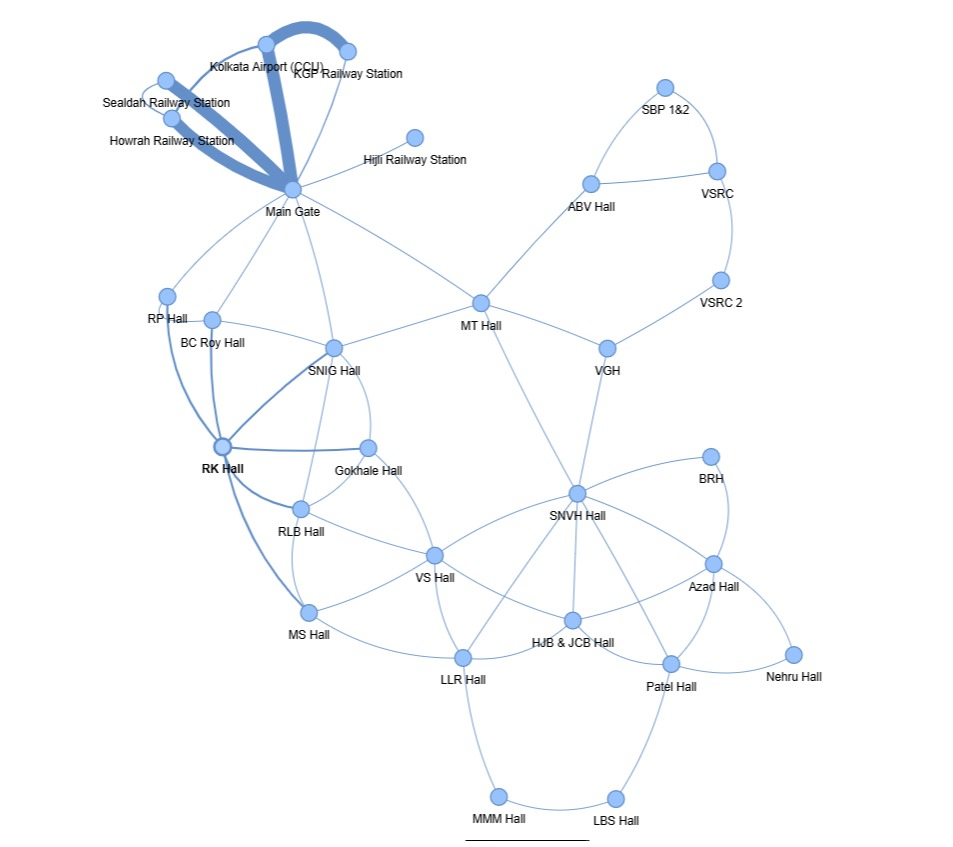

#  KGP-Pooling
[Live here](https://kgp-pooling.vercel.app/)

> **An automated, algorithm-driven transit matchmaking engine exclusively for IIT Kharagpur.**

KGP-Pooling eliminates the friction of manual ride coordination. Instead of spamming WhatsApp groups to find cab shares, students broadcast a "Travel Intent." The system's backend engine algorithmically groups users based on time overlaps, destination, vehicle constraints, and graph-based regional clustering, surfacing highly optimized Suggested Pools.

---

## The Problem Statement
During holidays and end-sems, thousands of IIT Kharagpur students travel to transit hubs (KGP Railway Station, Hijli, Howrah, CCU Airport) simultaneously. The current coordination method is entirely manual, leading to:
* **Inefficiency:** Students in neighboring halls leave at the same time in half-empty cabs.
* **Coordination Friction:** Finding users with overlapping departure flexibility and matching luggage constraints is a logistical nightmare.
* **Security & Trust:** Coordinating with unverified strangers outside the institute network.

## The Proposed Solution
A "No-Search" automated matchmaker. Users do not manually search or message strangers. They simply post their **Direction**, **Destination**, **Time Flexibility**, and **Luggage Level**. The system processes these constraints and outputs ready-to-accept **Suggested Pools**. Once a pool locks, a secure, real-time chat is instantly generated for the occupants.

---

## System Architecture

### High-Level Flow

### Technical Design Decisions
* **Authentication:** Google OAuth 2.0 strictly locked to `@kgpian.iitkgp.ac.in` domain accounts.
* **The Tracker Bypass (Vercel Proxy):** Mobile browsers (especially iOS Safari) aggressively block cross-origin authentication cookies. The frontend is hosted on Vercel with API rewrites routing to the Render backend, simulating a single-origin architecture to bypass ITP restrictions.
* **Split WebSockets:** HTTP requests utilize the proxy, while Socket.io establishes a direct handshake with Render to maintain persistent live-chat connections without Vercel's serverless timeout limits.
* **Database (MongoDB):** Selected for high schema flexibility, fast array operations (`$push` for pool members), and native Geospatial query readiness.
* **Timezone Normalization:** Enforces strict IST to UTC conversion on the client side to guarantee accurate departure matching regardless of device settings.

---

## The Matchmaking Algorithm
The engine processes intents differently based on the travel distance to optimize either *comfort* or *maximum savings*.

### Phase 1: Global Filters
1. **Direction Split:** "Leaving" (Hall to Station) and "Returning" (Station to Hall) are strictly isolated.
2. **Destination Split:** Intents are grouped by exact destination (e.g., KGP RS, Kolkata Airport).
3. **Time Window Overlap:** Candidates are only valid if their flexible departure windows mathematically overlap (e.g., 5:00 PM ±30m overlaps with 5:15 PM ±20m).

### Phase 2: Domain-Specific Grouping & Constraints

#### Case A: Short-Distance (KGP RS / Hijli RS)
* **Goal:** Minimize waiting time and prioritize pickup comfort.
* **Vehicle:** TOTO (Capacity: 4).
* **Logic:** Campus is divided into hardcoded Regions (e.g., MS/MT/SNIG is Region A). Users are strictly matched within their Region. No clustering algorithms are used to prevent long, meandering Toto routes.
* **Lock Conditions:** The pool automatically confirms and locks when **Luggage Capacity is reached** OR the **Time Window expires**. Totos are not forced to wait for maximum seat occupancy.

#### Case B: Long-Distance (Airport / Howrah / Sealdah)
* **Goal:** Maximize financial savings and utilize full vehicle capacity.
* **Vehicle:** Sedan (Cap: 3) / SUV (Cap: 4).
* **Logic:** Utilizes **Agglomerative Hierarchical Clustering**. The campus is mapped as an adjacency graph storing precomputed shortest-path distances. The algorithm treats each user intent as a cluster and merges nearest clusters first using Average Linkage, stopping when vehicle capacity is met.
* **Lock Conditions:** The pool confirms and locks when **Vehicle Capacity is reached**, **Luggage Limit is reached**, OR the **Time Window expires**.

### Phase 3: Ranking & Cancellation
* **Ranking:** Pools are scored and ranked on the user's feed based strictly on:
  1. Higher Member Count (Higher savings)
  2. Lower Average Pickup Distance
* **Cancellation Handling:** If a user deletes an intent, they are removed from the pool, all suggestions are wiped, the matchmaker reruns, and suggestions are dynamically regenerated for the remaining users.

---

## Quality Assurance & Load Testing
To ensure the mathematical validity and physical stability of the system, a decoupled testing architecture (`/testing` directory) was built to isolate QA scripts from production code.

* **High-Concurrency Load Testing (Artillery.js):** Architected automated pipelines to simulate campus-wide end-sem traffic spikes. Successfully blasted the server with **900 unique, randomized requests in 30 seconds**.
* **Database Throughput Validation:** Proven capability to handle heavy concurrency, generating and executing bulk database writes of **1,700+ optimized transit pools** into MongoDB during a 30-second window.
* **System Profiling:** Analyzed p95 latency metrics to identify CPU-bound event loop bottlenecks caused by synchronous mathematical clustering computations, establishing the precise roadmap for the next architectural iteration.

  
## UI/UX Flow

*(Screenshots located in the `assets/` directory)*

| Dashboard & Intents | Suggested Pools | Locked Pool Chat | Campus Map |
| :---: | :---: | :---: | :---: |
|  |  |  |  |

* **Single Intent:** A user can only hold one active intent at a time.
* **Locked Chat UI:** Users cannot access the chat section unless they have successfully accepted and confirmed a pool.
* **Dynamic Generation:** Upon pool lock, a Socket.io room is spun up displaying member names, phone numbers, pickup sequences, and luggage details.

---

## Future Scalability Roadmap
Having successfully optimized the database layer, the following backend architecture upgrades are slated to support 15,000+ concurrent students:

1. **Message Queue Offloading (Redis/BullMQ):** Moving the Agglomerative Clustering algorithm out of the main Express thread and into background worker threads to prevent Node.js event-loop blocking under heavy O(N^2) mathematical loads.
2. **Dashboard Caching:** Storing computationally expensive feed calculations in an in-memory Redis cache to serve the primary dashboard in ~1ms, bypassing MongoDB reads entirely until a cache invalidation is triggered.
3. **Mongoose Connection Pooling:** Establishing and holding a pool of active TCP connections to MongoDB, bypassing the SSL handshake delay during sudden traffic spikes.
4. **Rate Limiting:** Applying `express-rate-limit` to authentication and intent-creation endpoints to protect against brute-force script attacks.
